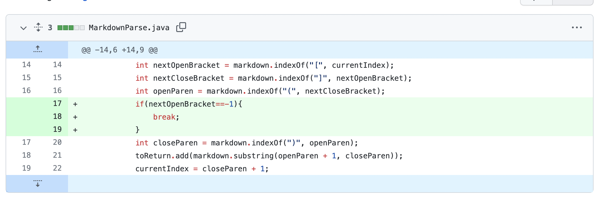
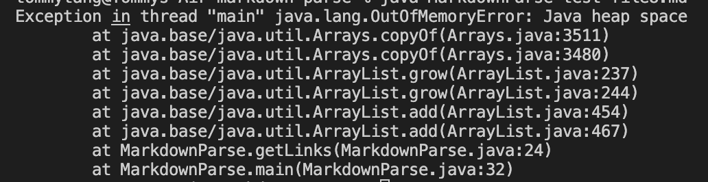
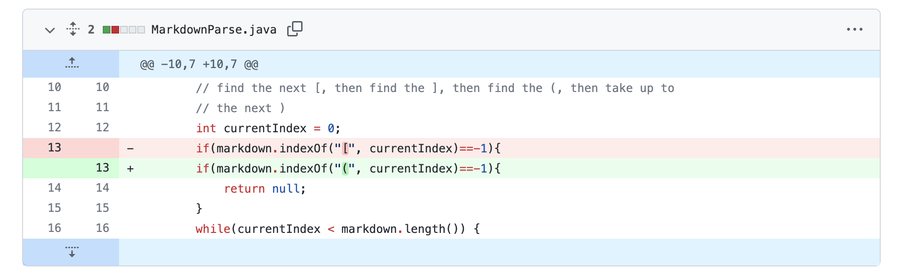
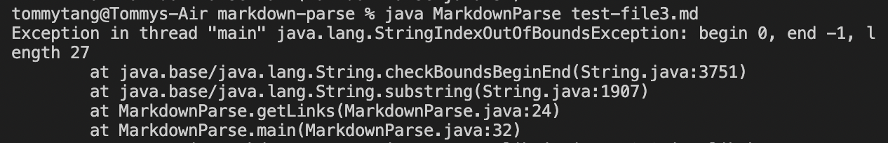
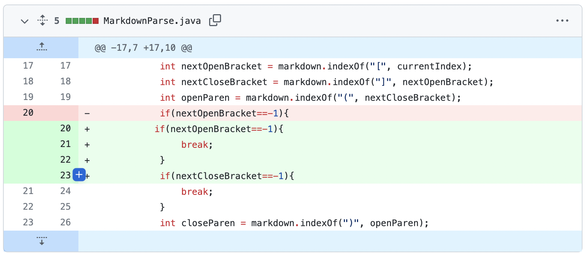

# Lab Report 2 - Bug Fixing

## 1st Change:

[link to the test file](https://github.com/skyeyestang99/markdown-parse/blob/main/test-file2.md)
#### **sympton of the failing output1**:

#### **relationship between the bug, the symptom, and the failure-inducing input**:
 The symptom occured as an infinite loop that causes the final output to run out of space. This is because there was a bug in the while loop program which will never ends until it reaches the end of the reading file. In the failure-inducing input, the end of our test file fails to meet the qualification of our while loop, which causes the sympton. 

## 2ed Change:

[link to the test file](https://github.com/skyeyestang99/markdown-parse/blob/main/test-file3.md)
#### **Sympton of the failing output**:

#### **relationship between the bug, the symptom, and the failure-inducing input**
The failure-inducing input does not provide us a link which causes the bug in our program to show the sympton of indexoutofBound. In the while loop, notice that all the variables use indexof() functions, which means if they can not find the string, they will return -1. Since there does not have an index -1, the program will result in such sympton.

## 3rd Change:

[link to the test file](https://github.com/ucsd-cse15l-w22/markdown-parse/edit/main/test-file8.md)
### **Sympton of the failing output**

#### **relationship between the bug, the symptom, and the failure-inducing input**
The failure-inducing input has a "[" at the end of the file, which results in the sympton of infinite loop. If we look at our program, the while loop will iterate at the last index which involves in indexOf() function. Since it will return -1, the program will never find the closed bracket. It will therefore result in the sympton we saw. 